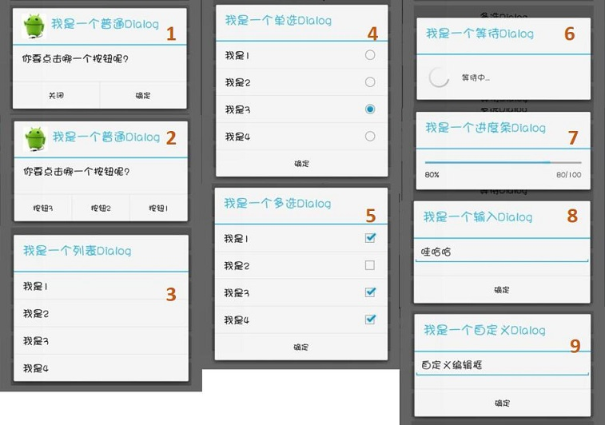

## Android 各种对话框（Dialog）实现

-  Android提供了丰富的`Dialog`函数，示例包含普通（提示消息和按钮）、列表、单选、多选、等待、进度条、编辑、自定义等多种形式。
- 重写Dialog的`create()`、`show()`、`dismiss()`等方法。
- `使用方法`可以查看[我的博客](http://www.cnblogs.com/gzdaijie/p/5222191.html)
